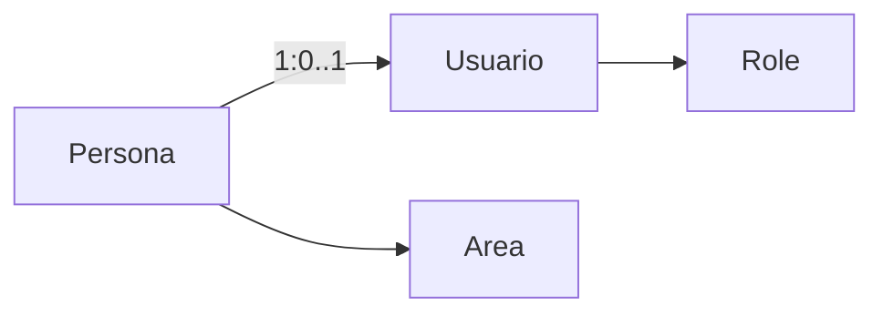

## Overview

PROD-SYS implements a personnel-centric user management model where each employee (persona) can have an associated system user account. This design separates organizational identity from system access, enabling flexible workforce management.

## Personnel vs Users

### Personnel (Personas)

**Database Table**: `personas`

Represents physical employees in your organization:

- Unique employee code (`codigo_interno`)
- Personal information (name, email, phone)
- Organizational assignment (area, role)
- Employment status (Activo, Incapacitado, Inactivo, Baja)
- Absence tracking (dates, type, reason)

### Users (Usuarios)

**Database Table**: `usuarios`

Represents system access credentials:

- Linked to a persona (optional for technical admin)
- Username and password
- System role (Administrador, Inspector, Supervisor, etc.)
- Access state (Activo, Inactivo)
- Security controls (lockout, password expiry)

### Relationship



- One persona can have zero or one user account
- Production staff may not need system access
- Administrative users must have a persona (except bootstrap admin)
- User account status is derived from persona employment status

**Location**: `backend/database/sqlite.js:1023-1066`

## User Lifecycle

### 1. System Bootstrap

**Initial Administrator Creation**

The first system startup requires creating the initial administrator:

**Endpoint**: `POST /api/bootstrap/initialize`

**Prerequisites**:
- System state: `NO_INICIALIZADO`
- No existing users in database

**Request Body**:
```json
{
  "nombre": "Juan",
  "apellido": "Pérez",
  "codigo_interno": "ADMIN001",
  "password": "SecurePassword123!"
}
```

**Process**:
1. Creates persona with `rol_organizacional = 'ADMIN'`
2. Creates user with `rol_id` = Administrador role
3. Sets system state to `INICIALIZADO`
4. Logs bootstrap event to audit trail

**Location**: `backend/domains/bootstrap/bootstrap.service.js:31-84`

<Warning>
  Bootstrap can only be performed once. After initialization, use normal user registration workflows.
</Warning>

### 2. Personnel Registration

**Register New Employee**

**Endpoint**: `POST /api/personnel/personal`

**Permission**: `MANAGE_STAFF`

**Request Body**:
```json
{
  "nombre": "María",
  "apellido": "González",
  "codigo_interno": "EMP001",
  "email": "maria.gonzalez@company.com",
  "telefono": "+52-123-456-7890",
  "area_id": 1,
  "fecha_ingreso": "2024-01-15",
  "rol_organizacional": "Operador de Telar"
}
```

**Automatic Actions**:
1. Validates unique `codigo_interno` and `email`
2. Creates persona record
3. Generates temporary password (8-character alphanumeric)
4. Creates user account with username = `codigo_interno`
5. Assigns default role (Operario for production staff)
6. Sets `must_change_password = true`
7. Returns temporary password (send via secure channel)

**Location**: `backend/domains/personal/personal.service.js:94-139`

**Response**:
```json
{
  "success": true,
  "data": {
    "id": 5,
    "tempPassword": "x7k2m9p4"
  },
  "message": "Personal registrado correctamente. Se ha generado una contraseña temporal."
}
```

<Info>
  In production, temporary passwords should be sent via email or SMS, not returned in API responses. The current implementation logs them for development convenience.
</Info>

### 3. User Account States

#### Employment Status (Personas)

| Status | Description | Access Impact |
|--------|-------------|---------------|
| **Activo** | Currently employed and working | Full system access if user exists |
| **Incapacitado** | Medical leave / disability | Login denied |
| **Inactivo** | Temporary leave (vacation, etc.) | Login denied |
| **Baja** | Terminated employment | Login denied, no modifications allowed |

**Location**: `backend/database/sqlite.js:1032`

#### Access Status (Usuarios)

| Status | Description | Effect |
|--------|-------------|--------|
| **Activo** | Account enabled | Can authenticate |
| **Inactivo** | Account disabled | Login denied |
| **Bloqueado** | Security lockout | Login denied until admin unlocks |

**Automatic Lockout**:
- Triggered after 5 consecutive failed login attempts
- Sets `bloqueado_at` timestamp
- Increments `intentos_fallidos` counter

**Location**: `backend/domains/auth/auth.service.js:64-71`

### 4. Status Management

**Update Employment Status**

**Endpoint**: `PUT /api/personnel/personal/:id`

**Permission**: `MANAGE_STAFF`

**Absence Registration** (Incapacitado/Inactivo):
```json
{
  "estado_laboral": "Incapacitado",
  "ausencia_desde": "2024-03-01",
  "ausencia_hasta": "2024-03-15",
  "tipo_ausencia": "Incapacidad",
  "motivo_ausencia": "Recuperación post-operatoria",
  "motivo_cambio": "Licencia médica aprobada"
}
```

**Business Rules**:
- `Incapacitado` requires `tipo_ausencia = 'Incapacidad'`
- `Inactivo` requires `tipo_ausencia = 'Permiso'`
- `ausencia_desde` and `ausencia_hasta` mandatory for absences
- `Baja` is terminal - no further modifications allowed

**Automatic Return**:
- System checks absence expiration daily
- Auto-reverts to `Activo` when `ausencia_hasta` is past
- Records automatic state change in audit log

**Location**: `backend/domains/personal/personal.service.js:141-198`

**Termination** (Baja):
```json
{
  "estado_laboral": "Baja",
  "ausencia_desde": "2024-03-10",
  "motivo_ausencia": "Renuncia voluntaria",
  "motivo_cambio": "Separación del colaborador"
}
```

<Warning>
  `Baja` status is permanent. The persona record becomes read-only. Plan carefully before applying this status.
</Warning>

### 5. Access Control Toggle

**Enable/Disable System Access**

**Endpoint**: `POST /api/personnel/personal/:id/toggle-acceso`

**Permission**: `MANAGE_STAFF`

**Use Case**: Temporarily disable system access without changing employment status

**Restrictions**:
- Only applies to Production area personnel
- Cannot modify if persona is in `Baja` status
- Does not affect employment record

**Request**:
```json
{
  "acceso_activo": false
}
```

**Effect**:
- Updates `usuarios.estado_usuario` to `Activo` or `Inactivo`
- Immediate session termination (checked on every request)
- Logged to audit trail

**Location**: `backend/domains/personal/personal.service.js:200-233`

## Role Assignment

### System Roles

**Available Roles** (defined in `roles` table):

| Role | Description | Key Permissions |
|------|-------------|-----------------|
| **Administrador** | Full system access | All permissions |
| **Inspector** | Quality and production management | MANAGE_STAFF, MANAGE_PRODUCTION, MANAGE_QUALITY, VIEW_AUDIT |
| **Supervisor** | Production oversight | VIEW_STAFF, ASSIGN_OPERATIONS, VIEW_PRODUCTION |
| **Jefe de Operaciones** | Operations leadership | MANAGE_STAFF, VIEW_PRODUCTION, MANAGE_MACHINES |
| **Gerencia** | Executive view | VIEW_* permissions (read-only access) |
| **Operario** | Production workers | MANAGE_PRODUCTION (own work) |

**Location**: `backend/shared/auth/permissions.js:24-67`

### Assign Role

**Endpoint**: `POST /api/personnel/personal/:id/asignar-rol`

**Permission**: `MANAGE_STAFF`

**Request**:
```json
{
  "rol_id": 2,
  "motivo_cambio": "Promoción a Inspector de Calidad",
  "es_correccion": false,
  "categoria_motivo": "AJUSTE_OPERATIVO"
}
```

**Parameters**:
- `rol_id`: ID from `roles` table
- `motivo_cambio`: Required justification for audit trail
- `es_correccion`: Flag for error corrections (prefixes with `[CORRECCIÓN]`)
- `categoria_motivo`: Optional audit category

**Process**:
1. Validates persona exists and is not in `Baja` status
2. Updates `usuarios.rol_id`
3. Creates history entry in `persona_roles` table
4. Logs to audit trail with action `ROLE_CHANGE`
5. Returns success

**Location**: `backend/domains/personal/personal.service.js:241-270`

## Password Management

### First Login Flow

**Must Change Password**:

All new users have `must_change_password = true`:

1. User logs in with temporary password
2. JWT payload includes `must_change_password: true`
3. Frontend enforces password change before accessing system
4. User submits new password via change password endpoint
5. `must_change_password` set to `false`

### Password Change

**Endpoint**: `POST /api/auth/change-password`

**Authentication**: Required (own account)

**Request**:
```json
{
  "currentPassword": "x7k2m9p4",
  "newPassword": "NewSecurePassword123!"
}
```

**Validation**:
- Current password must match (bcrypt comparison)
- New password must differ from current
- Updates `password_last_changed_at` timestamp
- Sets `must_change_password = false`

**Location**: `backend/domains/auth/auth.service.js:97-108`

### Admin Password Reset

**Endpoint**: `POST /api/personnel/personal/:id/reset-password`

**Permission**: `MANAGE_STAFF`

**Use Case**: User forgot password or account recovery

**Process**:
1. Generates new 8-character temporary password
2. Hashes with bcrypt (cost factor 10)
3. Updates user account
4. Sets `must_change_password = true`
5. Logs password reset to audit trail
6. Returns temporary password

**Response**:
```json
{
  "success": true,
  "data": {
    "tempPassword": "p3x9m2k7"
  }
}
```

**Location**: `backend/domains/personal/personal.service.js:272-293`

<Info>
  Temporary passwords should be communicated through secure out-of-band channels (email, SMS, or in-person).
</Info>

## User Authentication

### Login Flow

**Endpoint**: `POST /api/auth/login`

**Request**:
```json
{
  "username": "EMP001",
  "password": "UserPassword123!"
}
```

**Security Measures**:

1. **System Initialization Check**: Denies login if system not initialized
2. **User Lookup**: Retrieves user by username
3. **Employment Status Check**: Verifies persona is not in Baja/Incapacitado/Inactivo
4. **Account Lockout Check**: Verifies `bloqueado_at` is null
5. **Password Verification**: Constant-time bcrypt comparison
6. **Timing Attack Mitigation**: Ensures minimum 300ms processing time
7. **Failed Attempt Tracking**: Increments counter, locks after 5 failures
8. **Success**: Resets failed attempts, generates JWT

**Location**: `backend/domains/auth/auth.service.js:22-95`

**Response**:
```json
{
  "success": true,
  "data": {
    "token": "eyJhbGciOiJIUzI1NiIsInR5cCI6IkpXVCJ9...",
    "user": {
      "id": 5,
      "usuario_id": 5,
      "username": "EMP001",
      "rol": "Inspector",
      "nombre": "María González",
      "must_change_password": false
    }
  }
}
```

**Token Delivery**:
- Cookie: `token` (httpOnly, secure in production, sameSite: Strict)
- Response body: `data.token`

### Session Validation

Every authenticated API request:

1. Extracts JWT from `Authorization: Bearer <token>` or cookie
2. Verifies signature with `JWT_SECRET`
3. **Real-time status check**: Queries database for current `estado_usuario`
4. Denies access if user is no longer `Activo`
5. Attaches decoded user object to `req.user`

**Location**: `backend/middlewares/auth.middleware.js:8-53`

<Info>
  Session invalidation is **immediate**. Disabling a user account takes effect on their very next API request.
</Info>

## Operational Assignments

### Assign to Production

**Endpoint**: `POST /api/personnel/personal/:id/asignar-operacion`

**Permission**: `ASSIGN_OPERATIONS`

**Use Case**: Assign personnel to specific machines/processes

**Request**:
```json
{
  "proceso_id": 2,
  "maquina_id": 5,
  "turno": "T1",
  "permanente": false,
  "motivo_cambio": "Asignación semanal turno matutino"
}
```

**Validation**:
- Persona must be in `Activo` status
- Associated user must exist and be `Activo`
- Machine must not be in `Baja` or `Fuera de servicio` status
- Admin user (username='admin') cannot be assigned

**Creates Record in**: `asignaciones_operativas` table

**Location**: `backend/domains/personal/personal.service.js:295-354`

## Querying Users

### Get All Staff

**Endpoint**: `GET /api/personnel/personal`

**Permission**: `VIEW_STAFF`

**Returns**: List of all personas with enriched status information

**Enrichment**:
- Calculates `estado_efectivo` (effective status considering absence expiration)
- Flags `ausencia_vencida` if absence end date has passed
- Auto-updates expired absences to `Activo`

**Location**: `backend/domains/personal/personal.service.js:37-61`

### Get Staff Details

**Endpoint**: `GET /api/personnel/personal/:id`

**Permission**: `VIEW_STAFF`

**Returns**:
```json
{
  "success": true,
  "data": {
    "id": 5,
    "nombre": "María",
    "apellido": "González",
    "codigo_interno": "EMP001",
    "email": "maria.gonzalez@company.com",
    "area_nombre": "Departamento de Calidad",
    "estado_laboral": "Activo",
    "rol_actual": "Inspector",
    "historial_roles": [...],
    "asignaciones_activas": [...],
    "rol_operativo_actual": {...},
    "historial_grupos": [...],
    "historial_ausencias": [...]
  }
}
```

**Location**: `backend/domains/personal/personal.service.js:63-92`

## Best Practices

### User Provisioning

<Check>
  - [ ] Verify employee identity before creating accounts
  - [ ] Use secure channels for temporary password delivery
  - [ ] Assign roles based on job function, not individual
  - [ ] Document role assignment justifications
  - [ ] Review access permissions quarterly
</Check>

### Access Control

<Check>
  - [ ] Disable accounts immediately upon termination
  - [ ] Use `Baja` status for permanent employment termination
  - [ ] Review and remove unnecessary administrative privileges
  - [ ] Monitor failed login attempts for security threats
  - [ ] Require password changes every 90 days (implement policy)
</Check>

### Audit Compliance

<Check>
  - [ ] Always provide `motivo_cambio` for status changes
  - [ ] Use `es_correccion` flag when fixing data entry errors
  - [ ] Review audit logs regularly for unauthorized changes
  - [ ] Maintain separation of duties (different users for different roles)
</Check>

## Troubleshooting

### User Cannot Login

**Check**:
1. System initialization status (`SELECT valor FROM sistema_config WHERE clave = 'estado_sistema'`)
2. User account status (`SELECT estado_usuario FROM usuarios WHERE username = ?`)
3. Persona employment status (`SELECT estado_laboral FROM personas WHERE id = ?`)
4. Account lockout (`SELECT bloqueado_at, intentos_fallidos FROM usuarios WHERE username = ?`)

**Solutions**:
- If locked: Admin password reset clears lockout
- If inactive: Toggle access or update employment status
- If not initialized: Complete bootstrap process

### Cannot Modify User

**Check**:
1. Persona status: `Baja` is terminal, no modifications allowed
2. User role: Verify you have `MANAGE_STAFF` permission
3. Request format: Ensure all required fields present

### Temporary Password Not Working

**Check**:
1. Password not expired (no expiry currently implemented)
2. User not locked out from previous attempts
3. Correct username (case-sensitive)
4. Temporary password copied exactly (no extra spaces)

## Related Documentation

<CardGroup cols={2}>
  <Card title="Roles & Permissions" icon="shield" href="/admin/roles-permissions">
    Understanding permission mappings
  </Card>
  <Card title="Audit Logs" icon="list" href="/admin/audit-logs">
    Tracking user management actions
  </Card>
  <Card title="Configuration" icon="gear" href="/admin/configuration">
    Authentication and security settings
  </Card>
</CardGroup>