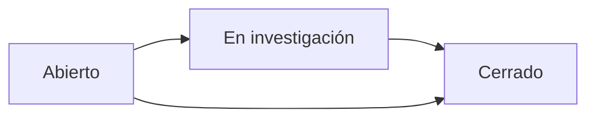

# Incidents API

The Incidents API manages production incidents reported during shifts. Incidents track quality issues, equipment failures, safety events, and other deviations from normal operations.

## Authentication

All write endpoints require `MANAGE_PRODUCTION` permission. Read endpoints require authentication.

## Get All Incidents

```http
GET /api/incidentes
```

Returns all production incidents, ordered by creation date descending.

### Response

Array of incident objects.

<ResponseField name="id" type="integer">
  Incident ID
</ResponseField>

<ResponseField name="titulo" type="string">
  Incident title/summary
</ResponseField>

<ResponseField name="descripcion" type="string">
  Detailed incident description
</ResponseField>

<ResponseField name="severidad" type="string">
  Severity level: Baja, Media, Alta
</ResponseField>

<ResponseField name="estado" type="string">
  Incident state: Abierto, En investigación, Cerrado
</ResponseField>

<ResponseField name="proceso_id" type="integer">
  Affected process ID (1-9)
</ResponseField>

<ResponseField name="proceso_nombre" type="string">
  Affected process name
</ResponseField>

<ResponseField name="turno" type="string">
  Shift when incident occurred: T1, T2, T3
</ResponseField>

<ResponseField name="fecha_incidente" type="string">
  ISO timestamp of incident occurrence
</ResponseField>

<ResponseField name="reportado_por" type="string">
  Username of person who reported the incident
</ResponseField>

<ResponseField name="accion_correctiva" type="string">
  Corrective action taken (null until closed)
</ResponseField>

<ResponseField name="fecha_cierre" type="string">
  ISO timestamp of incident closure (null if open)
</ResponseField>

### Example Request

```bash cURL
curl -X GET https://api.example.com/api/incidentes \
  -H "Authorization: Bearer <token>"
```

```javascript JavaScript
const response = await fetch('/api/incidentes', {
  headers: {
    'Authorization': `Bearer ${token}`
  }
});
const incidentes = await response.json();
```

### Example Response

```json
{
  "success": true,
  "data": [
    {
      "id": 42,
      "titulo": "Contaminación en lote EXT-001-12",
      "descripcion": "Se detectó material extranjero en el lote durante inspección de calidad. Aproximadamente 50kg afectados.",
      "severidad": "Alta",
      "estado": "En investigación",
      "proceso_id": 1,
      "proceso_nombre": "Extrusor PP",
      "turno": "T1",
      "fecha_incidente": "2026-03-06T10:30:00Z",
      "reportado_por": "Juan Pérez",
      "accion_correctiva": null,
      "fecha_cierre": null
    },
    {
      "id": 41,
      "titulo": "Falla mecánica TEL-03",
      "descripcion": "Telar 3 presentó falla en tensor principal. Producción detenida por 2 horas.",
      "severidad": "Media",
      "estado": "Cerrado",
      "proceso_id": 2,
      "proceso_nombre": "Telares",
      "turno": "T2",
      "fecha_incidente": "2026-03-05T17:15:00Z",
      "reportado_por": "María López",
      "accion_correctiva": "Reemplazo de tensor. Mantenimiento preventivo programado.",
      "fecha_cierre": "2026-03-05T20:00:00Z"
    }
  ]
}
```

## Create Incident

```http
POST /api/incidentes
```

**Permission:** `MANAGE_PRODUCTION`

Reports a new production incident.

### Request Body

<ParamField body="titulo" type="string" required>
  Brief incident title/summary (max 200 characters)
</ParamField>

<ParamField body="descripcion" type="string" required>
  Detailed description of what happened, impact, and context
</ParamField>

<ParamField body="severidad" type="string" required>
  Severity level:
  - `Baja` - Minor issue, no production impact
  - `Media` - Moderate impact, requires attention
  - `Alta` - Critical issue, immediate action required
</ParamField>

<ParamField body="proceso_id" type="integer" required>
  ID of affected process (1-9)
</ParamField>

<ParamField body="turno" type="string" required>
  Shift when incident occurred: T1, T2, or T3
</ParamField>

<ParamField body="fecha_incidente" type="string">
  ISO timestamp of incident occurrence (defaults to current time if not provided)
</ParamField>

<ParamField body="reportado_por" type="string">
  Username of reporter (defaults to authenticated user if not provided)
</ParamField>

### Example Request

```bash cURL
curl -X POST https://api.example.com/api/incidentes \
  -H "Authorization: Bearer <token>" \
  -H "Content-Type: application/json" \
  -d '{
    "titulo": "Desviación de temperatura en extrusor",
    "descripcion": "Zona 5 del extrusor alcanzó 280°C, excediendo el setpoint de 260°C por 15 minutos. Se ajustó controlador y se validó calidad del producto.",
    "severidad": "Media",
    "proceso_id": 1,
    "turno": "T2"
  }'
```

```javascript JavaScript
const response = await fetch('/api/incidentes', {
  method: 'POST',
  headers: {
    'Authorization': `Bearer ${token}`,
    'Content-Type': 'application/json'
  },
  body: JSON.stringify({
    titulo: 'Desviación de temperatura en extrusor',
    descripcion: 'Zona 5 del extrusor alcanzó 280°C...',
    severidad: 'Media',
    proceso_id: 1,
    turno: 'T2'
  })
});
const incidente = await response.json();
```

### Example Response

```json
{
  "success": true,
  "data": {
    "id": 43,
    "titulo": "Desviación de temperatura en extrusor",
    "estado": "Abierto",
    "fecha_incidente": "2026-03-06T15:45:00Z",
    "reportado_por": "Carlos Ruiz"
  }
}
```

## Update Incident

```http
PUT /api/incidentes/:id
```

**Permission:** `MANAGE_PRODUCTION`

Updates an existing incident, typically to add investigation details or close with corrective action.

### Path Parameters

<ParamField path="id" type="integer" required>
  Incident ID
</ParamField>

### Request Body

All fields are optional. Only provided fields will be updated.

<ParamField body="estado" type="string">
  Update state: Abierto, En investigación, Cerrado
</ParamField>

<ParamField body="accion_correctiva" type="string">
  Corrective action taken (required when closing incident)
</ParamField>

<ParamField body="descripcion" type="string">
  Update description with additional findings
</ParamField>

<ParamField body="severidad" type="string">
  Update severity if initial assessment was incorrect
</ParamField>

### Business Rules

- When changing state to `Cerrado`, `accion_correctiva` is mandatory
- Closing an incident automatically sets `fecha_cierre` to current timestamp
- Cannot reopen a closed incident (must create new incident if issue recurs)

### Example Request - Close Incident

```bash cURL
curl -X PUT https://api.example.com/api/incidentes/43 \
  -H "Authorization: Bearer <token>" \
  -H "Content-Type: application/json" \
  -d '{
    "estado": "Cerrado",
    "accion_correctiva": "Se recalibró el controlador de temperatura y se verificó el correcto funcionamiento durante 4 horas de operación. Producto generado durante el incidente fue sometido a pruebas adicionales y cumple especificaciones."
  }'
```

### Example Response

```json
{
  "success": true,
  "data": {
    "id": 43,
    "estado": "Cerrado",
    "accion_correctiva": "Se recalibró el controlador de temperatura...",
    "fecha_cierre": "2026-03-06T16:30:00Z"
  }
}
```

## Incident State Machine



**State Transitions:**
- `Abierto` → `En investigación`: When investigation starts
- `En investigación` → `Cerrado`: When root cause identified and corrective action completed
- `Abierto` → `Cerrado`: For minor incidents requiring immediate action

## Severity Guidelines

### Alta (High)

<Warning>
- Safety incidents or near-misses
- Product contamination or quality defects shipped to customers
- Equipment failure causing complete production stoppage
- Environmental incidents
- Requires immediate management notification
</Warning>

### Media (Medium)

<Info>
- Equipment malfunctions causing delays but not complete stoppage
- Quality deviations detected before shipment
- Process parameter excursions
- Requires investigation within 24 hours
</Info>

### Baja (Low)

<Note>
- Minor operational issues
- Cosmetic defects
- Brief delays or interruptions
- Can be addressed during normal operations
</Note>

## Integration with Shift Logs

Incidents are integrated with the Bitácora (shift log) system:

1. **Inline Reporting**: For Extrusor PP, incidents can be recorded directly within process data using the `incidentes` array:

```json
{
  "bitacora_id": 43,
  "proceso_id": 1,
  "incidentes": [
    {
      "hora": "10:30",
      "descripcion": "Temperatura Zona 5 fuera de rango",
      "accion": "Ajuste de controlador PID"
    }
  ]
}
```

2. **Closure Validation**: Shifts with open high-severity incidents may require supervisor approval before closure.

3. **Traceability**: Incidents are linked to specific shifts, processes, and production batches for full traceability.

## Best Practices

<Tip>
**Timely Reporting**: Report incidents as soon as they occur. Delays in reporting can compromise investigation and corrective action.
</Tip>

<Check>
**Detailed Descriptions**: Include:
- What happened (observable facts)
- When it happened (precise time if possible)
- Where it happened (specific equipment/location)
- Immediate actions taken
- Material/production affected
</Check>

<Warning>
**Root Cause, Not Blame**: Focus on identifying systemic issues and process improvements, not assigning blame to individuals.
</Warning>

## Common Workflows

### Equipment Failure

<Steps>
  <Step title="Report Incident">
    Operator reports equipment failure with `severidad: Alta`
  </Step>
  <Step title="Investigate">
    Maintenance team investigates, updates incident to `En investigación`
  </Step>
  <Step title="Corrective Action">
    Equipment repaired, maintenance log updated
  </Step>
  <Step title="Close">
    Supervisor closes incident with detailed corrective action description
  </Step>
  <Step title="Follow-up">
    Preventive maintenance schedule adjusted based on failure analysis
  </Step>
</Steps>

### Quality Deviation

<Steps>
  <Step title="Detection">
    Quality inspector detects deviation during sampling
  </Step>
  <Step title="Report">
    Inspector creates incident with affected batch information
  </Step>
  <Step title="Containment">
    Affected material quarantined, batch marked in system
  </Step>
  <Step title="Investigation">
    Production and quality teams investigate root cause
  </Step>
  <Step title="Resolution">
    Process adjusted, affected material dispositioned, incident closed
  </Step>
</Steps>

## Error Responses

<ResponseField name="400 Bad Request">
  Missing required fields or invalid data:
  ```json
  {
    "success": false,
    "error": "El campo 'titulo' es requerido."
  }
  ```
</ResponseField>

<ResponseField name="404 Not Found">
  Incident ID not found:
  ```json
  {
    "success": false,
    "error": "Incidente no encontrado."
  }
  ```
</ResponseField>

<ResponseField name="403 Forbidden">
  Insufficient permissions:
  ```json
  {
    "success": false,
    "error": "Permisos insuficientes."
  }
  ```
</ResponseField>

## Related Endpoints

- [Bitácora API](/api/production/bitacora) - Shift log management
- [Quality API](/api/quality/muestras) - Quality sample tracking
- [Audit Logs](/admin/audit-logs) - Incident audit trail
