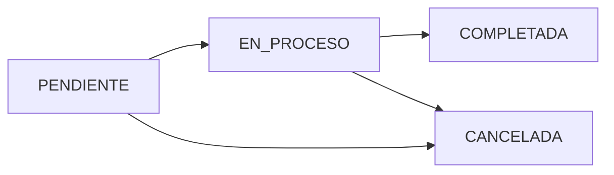

# Production Orders API

The Production Orders API manages manufacturing orders throughout their lifecycle, from creation to closure. It supports both manual entry and bulk import from SAP.

## Authentication

All write endpoints require `MANAGE_PRODUCTION` permission. Read endpoints require authentication but no specific permission.

## Get All Orders

```http
GET /api/ordenes-produccion
```

Returns all production orders, ordered by creation date descending.

### Response

Array of production order objects.

<ResponseField name="id" type="integer">
  Production order ID
</ResponseField>

<ResponseField name="numero_orden" type="string">
  Order number (internal or SAP)
</ResponseField>

<ResponseField name="descripcion" type="string">
  Product description
</ResponseField>

<ResponseField name="cantidad_objetivo" type="number">
  Target production quantity
</ResponseField>

<ResponseField name="unidad" type="string">
  Production unit (kg, m, unidades, etc.)
</ResponseField>

<ResponseField name="estado" type="string">
  Order state: PENDIENTE, EN_PROCESO, COMPLETADA, CANCELADA
</ResponseField>

<ResponseField name="codigo_sap" type="string">
  SAP material code (null for manual orders)
</ResponseField>

<ResponseField name="proceso" type="string">
  Target production process name
</ResponseField>

<ResponseField name="fecha_creacion" type="string">
  ISO timestamp of order creation
</ResponseField>

### Example Request

```bash cURL
curl -X GET https://api.example.com/api/ordenes-produccion \
  -H "Authorization: Bearer <token>"
```

### Example Response

```json
{
  "success": true,
  "data": [
    {
      "id": 12345,
      "numero_orden": "OP-2026-001",
      "descripcion": "Tela PP 105cm x 10x10",
      "cantidad_objetivo": 5000,
      "unidad": "m",
      "estado": "EN_PROCESO",
      "codigo_sap": "MAT-105-1010",
      "proceso": "Telares",
      "fecha_creacion": "2026-03-01T08:00:00Z"
    }
  ]
}
```

## Get Order by ID

```http
GET /api/ordenes-produccion/:id
```

Returns detailed information for a specific order.

### Path Parameters

<ParamField path="id" type="integer" required>
  Production order ID
</ParamField>

### Response

Single production order object with same fields as GET all.

### Error Responses

<ResponseField name="404 Not Found">
  ```json
  {
    "success": false,
    "error": "Orden de producción no encontrada."
  }
  ```
</ResponseField>

## Create Order

```http
POST /api/ordenes-produccion
```

**Permission:** `MANAGE_PRODUCTION`

Creates a new production order manually.

### Request Body

<ParamField body="numero_orden" type="string" required>
  Unique order number
</ParamField>

<ParamField body="descripcion" type="string" required>
  Product description
</ParamField>

<ParamField body="cantidad_objetivo" type="number" required>
  Target quantity (must be positive)
</ParamField>

<ParamField body="unidad" type="string" required>
  Unit of measure
</ParamField>

<ParamField body="proceso" type="string" required>
  Production process name (must match valid process)
</ParamField>

<ParamField body="codigo_sap" type="string">
  SAP material code (optional)
</ParamField>

### Example Request

```bash cURL
curl -X POST https://api.example.com/api/ordenes-produccion \
  -H "Authorization: Bearer <token>" \
  -H "Content-Type: application/json" \
  -d '{
    "numero_orden": "OP-2026-002",
    "descripcion": "Bolsa 50kg Laminada",
    "cantidad_objetivo": 10000,
    "unidad": "unidades",
    "proceso": "Conversión",
    "codigo_sap": "BAG-50-LAM"
  }'
```

### Example Response

```json
{
  "success": true,
  "data": {
    "id": 12346,
    "numero_orden": "OP-2026-002",
    "estado": "PENDIENTE",
    "fecha_creacion": "2026-03-06T10:30:00Z"
  }
}
```

## Update Order

```http
PUT /api/ordenes-produccion/:id
```

**Permission:** `MANAGE_PRODUCTION`

Updates an existing production order.

### Path Parameters

<ParamField path="id" type="integer" required>
  Production order ID
</ParamField>

### Request Body

Same fields as create, all optional. Only provided fields are updated.

<Warning>
Cannot update orders in COMPLETADA or CANCELADA states.
</Warning>

## Delete Order

```http
DELETE /api/ordenes-produccion/:id
```

**Permission:** `MANAGE_PRODUCTION`

Deletes a production order.

### Path Parameters

<ParamField path="id" type="integer" required>
  Production order ID
</ParamField>

### Business Rules

- Cannot delete orders with production history (lineas_ejecucion records)
- Only PENDIENTE orders can be safely deleted
- Consider changing state to CANCELADA instead

## SAP Import - Preview

```http
POST /api/ordenes-produccion/importar/previsualizar
```

**Permission:** `MANAGE_PRODUCTION`

**Content-Type:** `multipart/form-data`

Uploads an Excel file from SAP and returns parsed orders for preview before confirmation.

### Request Body

<ParamField body="archivo" type="file" required>
  Excel file (.xlsx) from SAP export
  
  Maximum file size: 10 MB
</ParamField>

### Expected Excel Format

From `ordenProduccion.parser.js:30`:

| Column | Description | Required |
|--------|-------------|----------|
| Orden de fabricación | Order number | Yes |
| Texto breve | Product description | Yes |
| Material | SAP material code | Yes |
| Cantidad objetivo / Cantidad de entrada | Target quantity | Yes |
| UnMed | Unit of measure | Yes |

### Response

<ResponseField name="ordenes" type="array">
  Parsed orders ready for confirmation
  <Expandable title="orden properties">
    <ResponseField name="numero_orden" type="string">
      Order number
    </ResponseField>
    <ResponseField name="descripcion" type="string">
      Product description
    </ResponseField>
    <ResponseField name="cantidad_objetivo" type="number">
      Target quantity
    </ResponseField>
    <ResponseField name="unidad" type="string">
      Unit of measure
    </ResponseField>
    <ResponseField name="codigo_sap" type="string">
      SAP material code
    </ResponseField>
    <ResponseField name="proceso" type="string">
      Inferred production process
    </ResponseField>
  </Expandable>
</ResponseField>

<ResponseField name="errores" type="array">
  Validation errors (if any)
</ResponseField>

<ResponseField name="advertencias" type="array">
  Warnings about potential issues
</ResponseField>

### Example Request

```bash cURL
curl -X POST https://api.example.com/api/ordenes-produccion/importar/previsualizar \
  -H "Authorization: Bearer <token>" \
  -F "archivo=@ordenes_sap.xlsx"
```

### Example Response

```json
{
  "success": true,
  "data": {
    "ordenes": [
      {
        "numero_orden": "1000012345",
        "descripcion": "TELA PP 105CM 10X10",
        "cantidad_objetivo": 5000,
        "unidad": "M",
        "codigo_sap": "100123456",
        "proceso": "Telares"
      },
      {
        "numero_orden": "1000012346",
        "descripcion": "BOLSA 50KG LAMINADA",
        "cantidad_objetivo": 10000,
        "unidad": "ST",
        "codigo_sap": "100123457",
        "proceso": "Conversión"
      }
    ],
    "errores": [],
    "advertencias": [
      "Orden 1000012345 ya existe en el sistema (será omitida al confirmar)"
    ]
  }
}
```

## SAP Import - Confirm

```http
POST /api/ordenes-produccion/importar/confirmar
```

**Permission:** `MANAGE_PRODUCTION`

Confirms and imports the previewed orders into the system.

### Request Body

<ParamField body="ordenes" type="array" required>
  Array of orders returned from preview endpoint
</ParamField>

### Response

<ResponseField name="insertadas" type="integer">
  Number of orders successfully inserted
</ResponseField>

<ResponseField name="omitidas" type="integer">
  Number of orders skipped (duplicates)
</ResponseField>

<ResponseField name="errores" type="array">
  Any errors during insertion
</ResponseField>

### Example Request

```bash cURL
curl -X POST https://api.example.com/api/ordenes-produccion/importar/confirmar \
  -H "Authorization: Bearer <token>" \
  -H "Content-Type: application/json" \
  -d '{
    "ordenes": [
      {
        "numero_orden": "1000012346",
        "descripcion": "BOLSA 50KG LAMINADA",
        "cantidad_objetivo": 10000,
        "unidad": "ST",
        "codigo_sap": "100123457",
        "proceso": "Conversión"
      }
    ]
  }'
```

### Example Response

```json
{
  "success": true,
  "data": {
    "insertadas": 1,
    "omitidas": 0,
    "errores": []
  }
}
```

## Process Mapping Logic

From `ordenProduccion.parser.js:90`, the system automatically maps SAP material codes to production processes:

```javascript
function inferirProceso(codigoSAP, descripcion) {
  const codigo = codigoSAP.toLowerCase();
  const desc = descripcion.toLowerCase();

  // Extrusor PP: códigos que inician con 101 o 102
  if (codigo.startsWith('101') || codigo.startsWith('102')) return 'Extrusor PP';

  // Telares: descripción contiene "tela"
  if (desc.includes('tela')) return 'Telares';

  // Laminado: descripción contiene "laminad"
  if (desc.includes('laminad')) return 'Laminado';

  // Impresión: descripción contiene "impr"
  if (desc.includes('impr')) return 'Impresión';

  // Conversión: bolsas sin liner
  if (desc.includes('bolsa') && !desc.includes('liner') && !desc.includes('vest')) return 'Conversión';

  // Vestidos: bolsas vestidas
  if (desc.includes('vest')) return 'Vestidos';

  // Liner PE: "liner" o códigos 108
  if (desc.includes('liner') || codigo.startsWith('108')) return 'Liner PE';

  return 'Conversión'; // Default
}
```

<Tip>
**Custom Mapping**: If your SAP codes don't match the default patterns, you can manually edit the `proceso` field after preview.
</Tip>

## Order State Machine



**State Transitions:**
- `PENDIENTE` → `EN_PROCESO`: Automatically when first production is recorded
- `EN_PROCESO` → `COMPLETADA`: When total production ≥ target quantity
- `*` → `CANCELADA`: Manual cancellation (requires justification)

## Best Practices

<Check>
**Batch Import**: Use the SAP import endpoints for efficient bulk order creation. This maintains consistency and reduces manual errors.
</Check>

<Warning>
**Duplicate Detection**: The system checks for duplicate order numbers. Duplicates are flagged in preview and skipped during confirmation.
</Warning>

<Tip>
**Process Validation**: Ensure the inferred process is correct during preview. Incorrect process assignment can cause workflow issues.
</Tip>

## Related Endpoints

- [Bitácora API](/api/production/bitacora) - Record production against orders
- [Planning API](/api/production/planning) - Schedule orders weekly
- [Dashboard API](/api/dashboard/orden) - View order execution details
