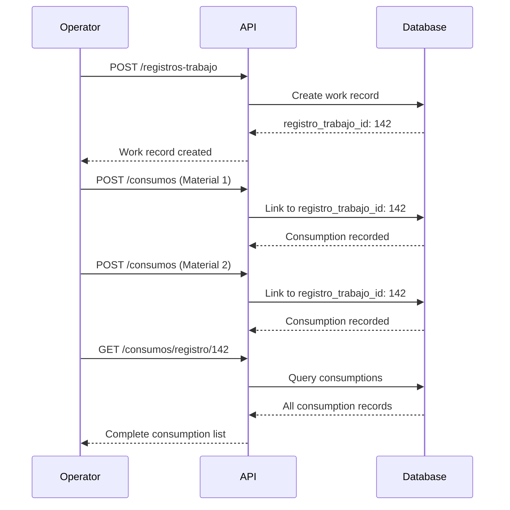

## Overview

The Consumos API records and retrieves resource consumption data linked to production work records. Each consumption entry tracks how much of a specific resource was used during a work activity.

Consumptions create traceability between:
- **Resources** ([Recursos API](/api/resources/recursos)) - What was consumed
- **Work Records** (`registros_trabajo`) - When and where it was consumed
- **Production Quantities** - Enabling yield and efficiency calculations

## Base URL

```
/api/consumos
```

---

## Get Consumptions by Work Record

<CodeGroup>
```bash GET /api/consumos/registro/:id
curl -X GET https://api.example.com/api/consumos/registro/142 \
  -H "Authorization: Bearer YOUR_TOKEN"
```
</CodeGroup>

Retrieves all resource consumptions associated with a specific work record (`registro_trabajo_id`), ordered by timestamp (most recent first).

### Path Parameters

<ParamField path="id" type="integer" required>
  The `registro_trabajo_id` (work record ID) to retrieve consumptions for
</ParamField>

### Response

<ResponseField name="success" type="boolean" required>
  Indicates if the request was successful
</ResponseField>

<ResponseField name="data" type="array" required>
  Array of consumption objects for the specified work record
  
  <Expandable title="Consumption Object">
    <ResponseField name="id" type="integer" required>
      Unique consumption record identifier
    </ResponseField>
    
    <ResponseField name="registro_trabajo_id" type="integer" required>
      Foreign key to the work record where this resource was consumed
    </ResponseField>
    
    <ResponseField name="recurso_id" type="integer" required>
      Foreign key to the resource that was consumed
    </ResponseField>
    
    <ResponseField name="cantidad_consumida" type="float" required>
      Quantity consumed (units defined by the resource's `unidad_medida`)
    </ResponseField>
    
    <ResponseField name="timestamp_consumo" type="datetime" required>
      ISO 8601 timestamp when the consumption occurred
    </ResponseField>
  </Expandable>
</ResponseField>

### Response Example

```json
{
  "success": true,
  "data": [
    {
      "id": 523,
      "registro_trabajo_id": 142,
      "recurso_id": 1,
      "cantidad_consumida": 245.5,
      "timestamp_consumo": "2026-03-06T14:23:00.000Z"
    },
    {
      "id": 524,
      "registro_trabajo_id": 142,
      "recurso_id": 3,
      "cantidad_consumida": 12.8,
      "timestamp_consumo": "2026-03-06T14:23:00.000Z"
    },
    {
      "id": 525,
      "registro_trabajo_id": 142,
      "recurso_id": 7,
      "cantidad_consumida": 8.5,
      "timestamp_consumo": "2026-03-06T14:25:00.000Z"
    }
  ]
}
```

---

## Create Consumption Record

<CodeGroup>
```bash POST /api/consumos
curl -X POST https://api.example.com/api/consumos \
  -H "Authorization: Bearer YOUR_TOKEN" \
  -H "Content-Type: application/json" \
  -d '{
    "registro_trabajo_id": 142,
    "recurso_id": 1,
    "cantidad_consumida": 245.5,
    "timestamp_consumo": "2026-03-06T14:23:00.000Z"
  }'
```
</CodeGroup>

Records a new resource consumption against a work record.

**Required Permission:** `MANAGE_PRODUCTION`

### Request Body

<ParamField path="registro_trabajo_id" type="integer" required>
  ID of the work record (`registros_trabajo`) where this consumption occurred. Must reference an existing work record.
</ParamField>

<ParamField path="recurso_id" type="integer" required>
  ID of the resource being consumed. Must reference an existing resource from the [Recursos API](/api/resources/recursos).
</ParamField>

<ParamField path="cantidad_consumida" type="float" required>
  Quantity consumed, measured in the resource's `unidad_medida` (kg, liters, units, etc.). Must be a positive number.
</ParamField>

<ParamField path="timestamp_consumo" type="datetime" required>
  ISO 8601 timestamp indicating when the consumption occurred. Should typically align with the work record's production time.
</ParamField>

### Response

Returns the created consumption record with the generated `id`.

<ResponseField name="success" type="boolean" required>
  Indicates if the creation was successful
</ResponseField>

<ResponseField name="data" type="object" required>
  The created consumption object including the auto-generated `id`
</ResponseField>

### Response Example

```json
{
  "success": true,
  "data": {
    "id": 526,
    "registro_trabajo_id": 142,
    "recurso_id": 1,
    "cantidad_consumida": 245.5,
    "timestamp_consumo": "2026-03-06T14:23:00.000Z"
  }
}
```

---

## Data Model

### Consumption Schema

The `CONSUMO` table structure:

| Column | Type | Constraints | Description |
|--------|------|-------------|-------------|
| `id` | INTEGER | PRIMARY KEY, AUTOINCREMENT | Unique consumption identifier |
| `registro_trabajo_id` | INTEGER | FOREIGN KEY → `registros_trabajo(id)` | Work record reference |
| `recurso_id` | INTEGER | FOREIGN KEY → `RECURSO(id)` | Resource reference |
| `cantidad_consumida` | REAL | - | Quantity consumed |
| `timestamp_consumo` | DATETIME | - | Consumption timestamp |

### Relationships

```
registros_trabajo (1) ──── (N) CONSUMO (N) ──── (1) RECURSO
```

- **Work Record** (`registros_trabajo`): One work record can have multiple consumption entries
- **Resource** (`RECURSO`): One resource can be consumed multiple times across different work records
- This creates a many-to-many relationship between work records and resources, with consumption quantities tracked in the junction table

### Related Tables

#### registros_trabajo
Work records from production operations:
- `id`: Work record identifier
- `cantidad_producida`: Output quantity
- `linea_ejecucion_id`: Production line reference
- `maquina_id`: Machine reference
- `fecha_hora`: Production timestamp

#### RECURSO
Resource catalog (see [Recursos API](/api/resources/recursos)):
- `id`: Resource identifier
- `codigo`: Resource code
- `nombre`: Resource name
- `unidad_medida`: Unit of measurement for quantities

---

## Usage Examples

### Recording Material Consumption During Production

```bash
# Record polypropylene consumption
curl -X POST https://api.example.com/api/consumos \
  -H "Authorization: Bearer YOUR_TOKEN" \
  -H "Content-Type: application/json" \
  -d '{
    "registro_trabajo_id": 142,
    "recurso_id": 1,
    "cantidad_consumida": 245.5,
    "timestamp_consumo": "2026-03-06T14:23:00.000Z"
  }'

# Record adhesive consumption
curl -X POST https://api.example.com/api/consumos \
  -H "Authorization: Bearer YOUR_TOKEN" \
  -H "Content-Type: application/json" \
  -d '{
    "registro_trabajo_id": 142,
    "recurso_id": 3,
    "cantidad_consumida": 12.8,
    "timestamp_consumo": "2026-03-06T14:23:00.000Z"
  }'
```

### Retrieving All Consumptions for a Work Record

```bash
curl -X GET https://api.example.com/api/consumos/registro/142 \
  -H "Authorization: Bearer YOUR_TOKEN"
```

### Complete Production Recording Workflow

```bash
# 1. Create work record (hypothetical endpoint)
curl -X POST https://api.example.com/api/registros-trabajo \
  -H "Authorization: Bearer YOUR_TOKEN" \
  -H "Content-Type: application/json" \
  -d '{
    "linea_ejecucion_id": 23,
    "maquina_id": 5,
    "cantidad_producida": 1500.0,
    "fecha_hora": "2026-03-06T14:30:00.000Z"
  }'

# Response: {"success": true, "data": {"id": 143, ...}}

# 2. Record primary material consumption
curl -X POST https://api.example.com/api/consumos \
  -H "Authorization: Bearer YOUR_TOKEN" \
  -H "Content-Type: application/json" \
  -d '{
    "registro_trabajo_id": 143,
    "recurso_id": 1,
    "cantidad_consumida": 1650.0,
    "timestamp_consumo": "2026-03-06T14:30:00.000Z"
  }'

# 3. Record secondary material consumption
curl -X POST https://api.example.com/api/consumos \
  -H "Authorization: Bearer YOUR_TOKEN" \
  -H "Content-Type: application/json" \
  -d '{
    "registro_trabajo_id": 143,
    "recurso_id": 4,
    "cantidad_consumida": 85.0,
    "timestamp_consumo": "2026-03-06T14:30:00.000Z"
  }'

# 4. Later, retrieve all consumptions for analysis
curl -X GET https://api.example.com/api/consumos/registro/143 \
  -H "Authorization: Bearer YOUR_TOKEN"
```

---

## Calculating Production Metrics

Combining consumption data with production output enables key manufacturing metrics:

### Material Yield

```
Yield (%) = (cantidad_producida / suma_cantidad_consumida) × 100
```

Example with work record #142:
- Produced: 1500 kg
- Consumed: 245.5 kg (recurso #1) + 12.8 kg (recurso #3) = 258.3 kg
- Yield: (1500 / 258.3) × 100 = 580.6% (indicates output measurement differs from input)

### Specific Consumption

```
Specific Consumption = cantidad_consumida / cantidad_producida
```

Example:
- Adhesive consumed: 12.8 kg
- Product produced: 1500 kg
- Specific consumption: 12.8 / 1500 = 0.0085 kg adhesive per kg product

### Resource Usage Over Time

Query multiple work records to track:
- Total consumption by resource type
- Consumption trends over time
- Machine-specific consumption patterns
- Production efficiency variations

---

## Error Handling

### Common Error Responses

#### 400 Bad Request - Missing Required Field

```json
{
  "success": false,
  "error": "Missing required field: recurso_id"
}
```

#### 400 Bad Request - Invalid Data Type

```json
{
  "success": false,
  "error": "cantidad_consumida must be a positive number"
}
```

#### 401 Unauthorized

```json
{
  "success": false,
  "error": "Authentication required"
}
```

#### 403 Forbidden

```json
{
  "success": false,
  "error": "Insufficient permissions. Required: MANAGE_PRODUCTION"
}
```

#### 404 Not Found - Invalid Work Record

```json
{
  "success": false,
  "error": "Work record with id 999 not found"
}
```

#### 404 Not Found - Invalid Resource

```json
{
  "success": false,
  "error": "Resource with id 999 not found"
}
```

#### 500 Internal Server Error

```json
{
  "success": false,
  "error": "Database error occurred"
}
```

---

## Best Practices

### Timestamp Accuracy

- Record `timestamp_consumo` as close to actual consumption time as possible
- For batch operations, use the midpoint or start of production
- Maintain consistency within each work record (same or similar timestamps)
- Use UTC timestamps to avoid timezone issues

### Quantity Precision

- Match precision to your measurement equipment capabilities
- For weight-based materials: typically 1-2 decimal places (e.g., 245.5 kg)
- For volume-based liquids: 1-2 decimal places (e.g., 12.8 liters)
- For discrete units: whole numbers (e.g., 150 units)

### Resource Validation

Before recording consumption:

1. Verify the resource exists in the catalog ([Recursos API](/api/resources/recursos))
2. Confirm the work record exists and is still open/editable
3. Ensure units match expectations (kg vs. liters vs. units)
4. Validate quantities are within reasonable ranges

### Data Integrity

- Record all material consumptions for complete traceability
- Include both primary and secondary materials
- Don't forget indirect consumptions (adhesives, inks, etc.)
- Maintain referential integrity with work records

### Batch Recording

When recording multiple consumptions for one work record:

```bash
# Record all materials consumed in a single production run
for recurso in "1:245.5" "3:12.8" "7:8.5"; do
  IFS=':' read -r recurso_id cantidad <<< "$recurso"
  curl -X POST https://api.example.com/api/consumos \
    -H "Authorization: Bearer YOUR_TOKEN" \
    -H "Content-Type: application/json" \
    -d "{
      \"registro_trabajo_id\": 142,
      \"recurso_id\": $recurso_id,
      \"cantidad_consumida\": $cantidad,
      \"timestamp_consumo\": \"2026-03-06T14:23:00.000Z\"
    }"
done
```

---

## Integration Patterns

### Production Recording Flow



### Reporting and Analytics

Retrieval pattern for production analysis:

1. Query work records by date range, machine, or production line
2. For each work record, retrieve consumptions via `GET /consumos/registro/:id`
3. Join with resource catalog to get names and units
4. Calculate metrics (yield, specific consumption, etc.)
5. Aggregate across multiple work records for trends

---

## Related Endpoints

- [Recursos API](/api/resources/recursos) - Resource catalog management
- [Registros de Trabajo](/api/production/bitacora) - Work records and production output
- [Líneas de Ejecución](/api/production/ordenes) - Production line management
